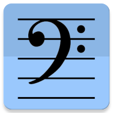

# Unpopular Music Player

A plain music player especially for **classical music**, playing locally stored music files.

As "pop music" is an abbreviation for "popular music", any other music obviously is "unpopular".

***

***

# Music Organisation

Other music player apps are meant for pop music only and deal with "Songs" and "Artists". This is not suitable for classical (baroque, renaissance, ...) music which is organised by composer, work, movements and performers.

Pop music:

Artist | Album  | Song
-------| ------ | -------------
Smith | Heaven  | 1. Love you, babe
 | | 2. Babe, love you
 | | 3. More love, babe, inne wadr
Jones  | Freedom | 1. Babe, I'm free
 | | 2. Free the innrnatt

Classical music needs more metadata ("tags"), especially the *composer tag* and *grouping tag*, the latter is used to group the movements together:

| Album  | Composer  | Work | Performer | Movement
|------- |-----------| -----| --- | ---
| Cello Concertos | Joseph Haydn | Concerto No. 1 | Fred Stone | 1. Allegro
|                 |              |                |            | 2. Adagio 
|                 |              |                |            | 3. Presto 
|                 | Hella Haydn  | Concerto No. 3 | Jean Water | 1. Allegro
|                 |              |                |            | 2. Adagio

For more information see the Google Play Store entry or the offline help text of the application.

# Supported

* Starts with album list
* Cover art, using Android's internal database
* Composer and grouping (work, movements)
* Nowhere text is truncated (with "..."), even the longest work and movement descriptions get the space they need.
* Two colour themes
* Scalable UI, also for tablets
* Portrait and landscape orientation
* Small, fast, low system resources
* Perfect gendering-ism, especially designed for useresses and users from German civil service.

# Not Supported
* Sophisticated animations
* Searching by text
* Artists or genre views
* Folder views
* Metada editing
* Cover downloading
* (Un-)Equalizer
* "Songs"
* ...

# Permissions Needed
* Read storage
* Prevent phone from sleeping

# License

The Unpopular Music Player is licensed according to GPLv3, see LICENSE file.

# External Licenses

**Jaudiotagger library:**  
Source: http://www.jthink.net/jaudiotagger/  
Copyright: paultaylor@jthink.net  
License: http://www.gnu.org/copyleft/lesser.html
